# How to Setup a TV Display using Linux Mint

The instructions below describe the process of setting up a [Linux Mint](https://www.linuxmint.com/) machine to run the TV Display.
Linux Mint is by no means the required distribution for running the TV Display application.
Depending on the computer you intend to use to run the display, Linux Mint may be too heavy.
It's just a really friendly, easy to use distribution for anyone who might be intimidated by setting this up on Linux.
Any distribution should work.

The instructions below include details for two types of installations, depending on where the TV Display application is hosted.

- If the display machine will have good network connectivity,
  the TV Display application can be hosted from a web server running on a different computer.
  This is best if multiple displays will be used as the configuration can be centralized.

- If network connectivity will be an issue, or if only one display is needed,
  the TV Display application can run on the same machine that is used to display the content.
  There are additional steps to run a *local installation*, but it's still pretty easy.


## Prerequisites

- A computer running Linux Mint.  (See the [Linux Mint Installation Guide](https://linuxmint-installation-guide.readthedocs.io/en/latest/) for assistance.)
- A network connection for the setup process.
  Once set up, the machine should be able to run offline if the local installation steps are followed.


## Update the Computer

To ensure things run smoothly, it's best to update all of the software on the computer to it's latest versions.
Linux Mint handles its update using an application called **Update Manager**.

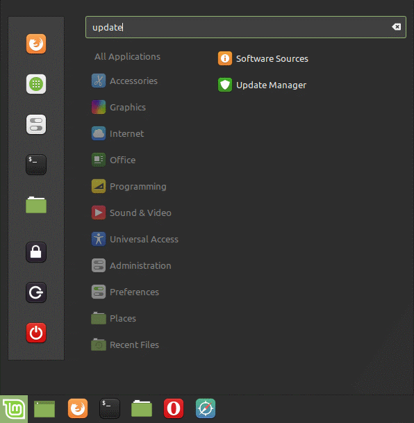

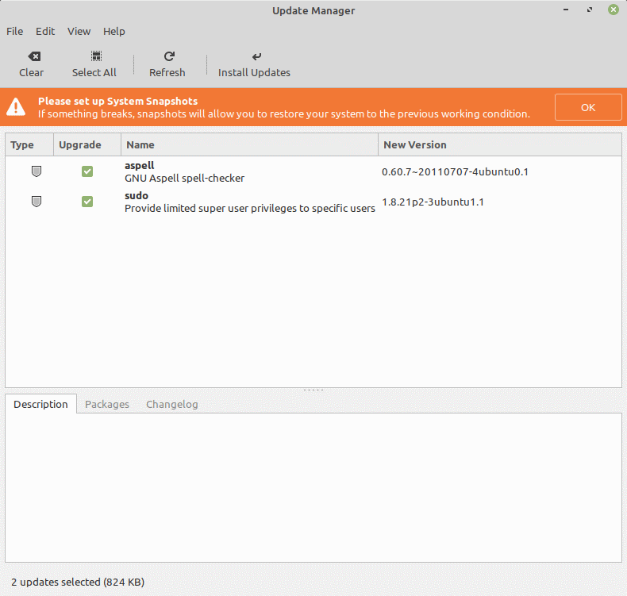

Install all available updates.

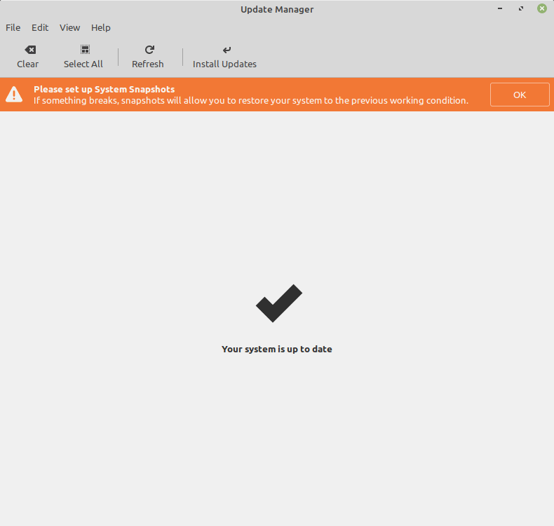


## Disable the Screensaver

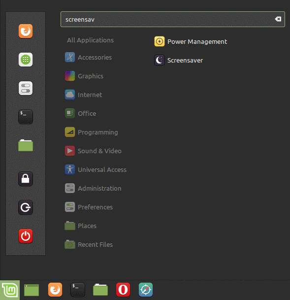

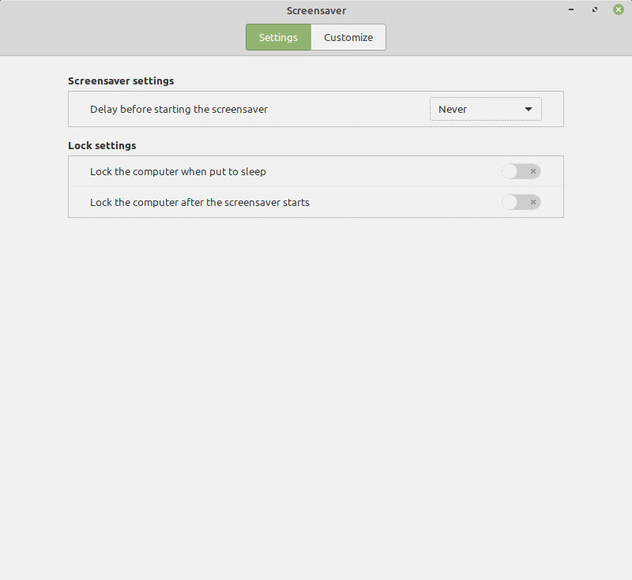

- Set "Delay before starting the screensaver" to **Never**.
- Turn off "Lock the computer when put to sleep".
- Turn off "Lock the computer after the screensaver starts".


## Adjust the Power Saving Options

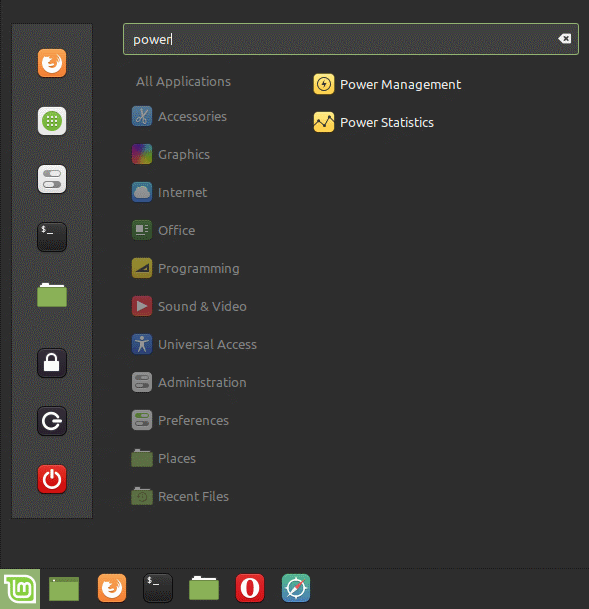

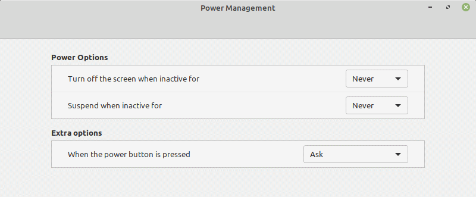

- Set "Turn off the screen when inactive for" to **Never**.
- Set "Suspend when inactive for" to **Never**.


## Install Additional Software

The additional applications required for this installation can be found in the **Software Manager** application.

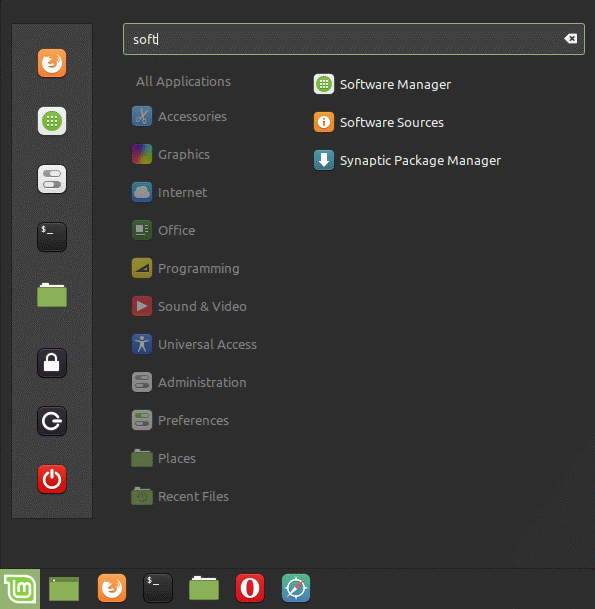

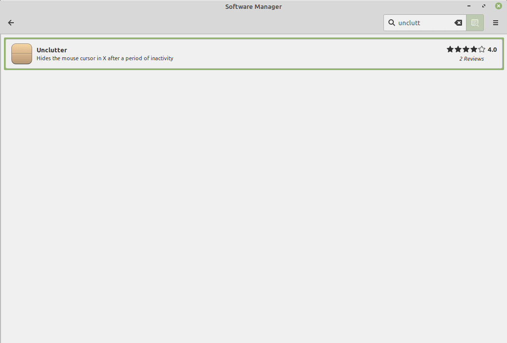

Search for each of the following applications.  Click on them to see their details.  Click Install to install them.

### All Installations

- **Chromium** (the browser that will display the application)
- **Chromium-codecs-ffmpeg** and **Chromium-codecs-ffmpeg-extra** (optional for increased video support)
- **Unclutter** (hides the mouse cursor when the mouse isn't moving)

### Local Installations Only

- **Geany** (for easier JSON editing)
- **Git** (for downloading and updating the TV Display application)
- **Nginx-light** (a web server for hosting the TV Display application)
- **Openjdk-11-jre** (runs the FilesJsonGenerator.jar application, Openjdk-8-jre or better should be fine)


## Install and Configure the TV Display Application (Local Installations Only)

*If you're installing the TV Display application on another server,
documentation is coming, but will be very similar to the steps described below.*

The next steps will run in the Terminal.

*Important Note: Only type the command as it appears after the $ symbol.*

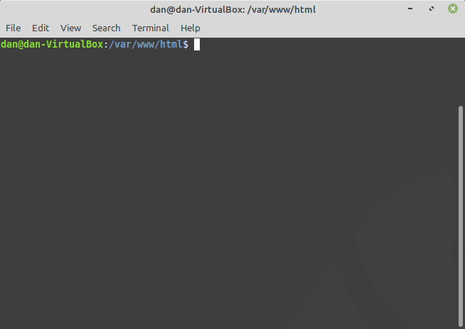

The default folder location for nginx on Linux Mint is `/var/www/html`.  Go to that directory.

```bash
$  cd /var/www/html
```

Clone the tv-display repository.

```bash
/var/www/html$  sudo git clone https://github.com/cityssm/tv-display.git
```

If successful, you should now be able to view the default configuration by visiting
http://localhost/tv-display

Make a directory for the display's custom content.

```bash
/var/www/html$  sudo mkdir tv-assets
/var/www/html$  chmod 777 tv-assets
```

For help getting started, copy over `template-offline.json` from the `tv-display/config` directory.
This template makes it easy to run through three groups of images (imageList content)
while displaying a clock in between.

```bash
/var/www/html$  cd tv-assets
/var/www/html/tv-assets$  cp ../tv-display/config/template-offline.json config.json
```

For easier refreshing of the imageList `files.json` files, download the
`FilesJsonGenerator.jar` from the [cityssm/tv-display/filesJSON repository](https://github.com/cityssm/tv-display-filesJSON).

```bash
/var/www/html/tv-assets$  wget https://github.com/cityssm/tv-display-filesJSON/raw/master/dist/FilesJsonGenerator.jar
/var/www/html/tv-assets$  wget https://github.com/cityssm/tv-display-filesJSON/raw/master/dist/generateFilesJSON.sh
```


## Setup the Startup Applications

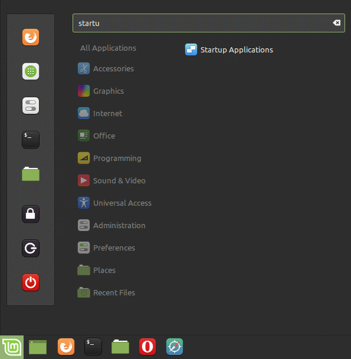

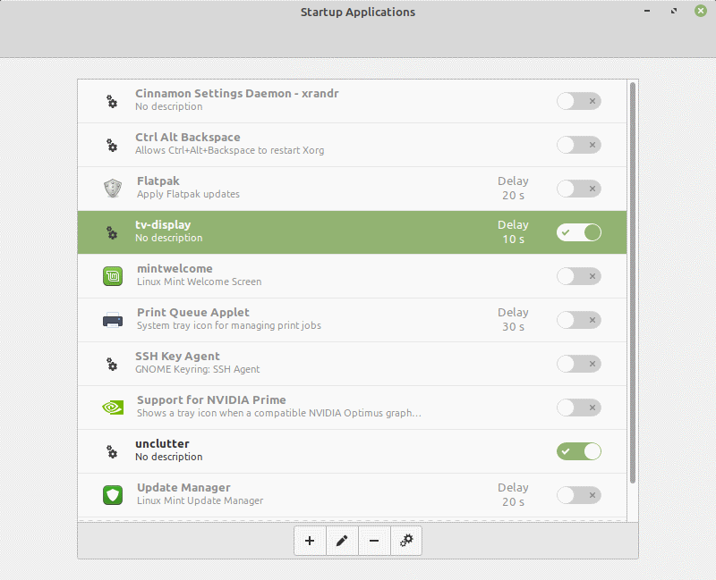

Disable all of the startup applications in the list.

First we'll add the application to make the mouse cursor disappear when its inactive.
Click the **+** button to add a **Custom Command**.

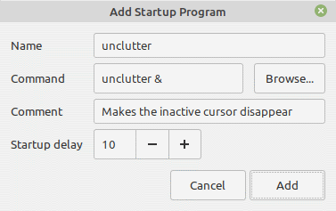

- Set the "Name" to **unclutter**.
- Set the "Command" to `unclutter &`
- Set the "Startup delay" to **10 seconds**.
- Click Add.

Next, we'll add the Chromium browser.
Again, click the **+** button to add a **Custom Command**.

- Set the "Name" to **tv-display**.
- Set the "Command" to the following, all on one line.  (It's only separated to make reading all of those switches easier.)

```console
chromium-browser http://localhost/tv-display/?config=/tv-assets/config
  --start-fullscreen --kiosk --noerrdialogs --disable-translate
  --no-first-run --fast --fast-start --disable-infobars
  --password-store=basic
```

*Note that if you're TV Display application is running on another machine,
the website address should be changed accordingly.*

- Set the "Startup delay" to **10 seconds**.
- Click Add.

You can test the success of the above command by highlighting the "tv-display" entry,
and clicking the Run Now "gears" button.


## Restart the Computer

On restart, the computer should load up the display with the configuration you copied over.
Use <kbd>Alt</kbd> <kbd>F4</kbd> to leave the full screen Chromium browser.

Now it's time to start customizing your content with the `config.json` file.
(Documentation is the works.)


## Appendix - Updating the TV Display Application (Local Installations Only)

Is there a new feature or bug fix you need for the TV Display application?

Connect the machine to the Internet and open a Terminal.
The following command will download the latest code from GitHub.

```bash
$  cd /var/www/html/tv-display
/var/www/html/tv-display$  sudo git pull origin master
```

While you're connected to a network, visit the **Update Manager** application as well to get the latest updates for your machine in general.
